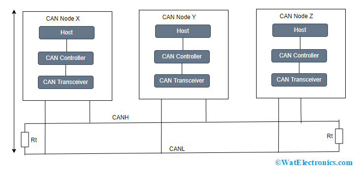

# CAN (Controller Area Network) Communication Protocol
-----------------------------------------------------------

## Table of Contents
1. [Introduction](#introduction)
2. [CAN High and CAN Low](#can-high-and-can-low)
3. [Termination Resistance](#termination-resistance)
4. [Additional Details](#additional-details)

----------------------------------------

## Introduction
CAN (Controller Area Network) is a widely used communication protocol in the automotive and industrial sectors for reliable and efficient data exchange between electronic control units (ECUs). It was initially developed by Bosch in the 1980s to address the increasing complexity of electrical systems in vehicles and has since become an industry standard. The CAN protocol allows multiple ECUs to communicate with each other over a shared bus, enabling real-time data transmission.

## CAN High and CAN Low
CAN communication uses a differential pair of wires for transmission: CAN High (CAN-H) and CAN Low (CAN-L). The differential signaling means that the information is transmitted as the voltage difference between these two wires. When a logical '0' is transmitted, the voltage on CAN-H is higher than on CAN-L, and when a logical '1' is transmitted, the voltage on CAN-L is higher than on CAN-H.

## Termination Resistance
The CAN bus requires termination resistors at both ends of the network. The purpose of these termination resistors (typically 120 ohms) is to prevent signal reflections and ensure proper signal integrity. When a CAN signal reaches the end of the bus, without termination, the signal could reflect back and interfere with the original signal, leading to data corruption and communication errors.

## Additional Details
Here are some additional key points about the CAN protocol:

- Multi-Master Communication: CAN allows for multi-master communication, which means any node on the bus can transmit data. There is no central master controlling the communication.

- Message-Based Communication: CAN uses a message-based communication paradigm. Each node on the bus can send and receive messages. Messages are identified by unique identifiers (IDs) ranging from 0 to 2,047 (CAN 2.0A) or 0 to 2,103,551 (CAN 2.0B). Lower IDs have higher priority.

- Error Detection and Handling: CAN has built-in error detection mechanisms, including Cyclic Redundancy Check (CRC), to ensure data integrity. In case of errors, the protocol implements automatic retransmission and error handling.

- Data Frame Formats: CAN supports two types of data frames - Standard Data Frames (CAN 2.0A) and Extended Data Frames (CAN 2.0B). Standard frames have 11-bit IDs, while extended frames have 29-bit IDs, allowing for a larger number of unique messages.

- Speed and Reliability: CAN is known for its high reliability and fault tolerance. It can operate at various data rates, with common speeds like 125 kbps, 250 kbps, 500 kbps, and 1 Mbps.

- Applications: CAN is widely used in automotive applications for communication between ECUs, such as engine control modules, transmission control modules, airbag systems, and more. It is also used in industrial automation, robotics, and other fields where reliable and real-time communication is essential.

Overall, the CAN protocol's robustness, reliability, and efficiency have made it a preferred choice for a broad range of applications, particularly in the automotive industry, where multiple ECUs must exchange data seamlessly and efficiently.
